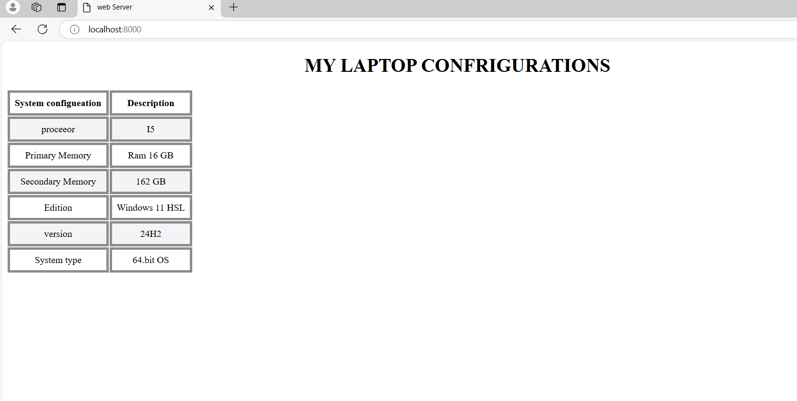

# EX01 Developing a Simple Webserver
## Date:
24.10.24

## AIM:
To develop a simple webserver to serve html pages and display the configuration details of laptop.

## DESIGN STEPS:
### Step 1: 
HTML content creation.

### Step 2:
Design of webserver workflow.

### Step 3:
Implementation using Python code.

### Step 4:
Serving the HTML pages.

### Step 5:
Testing the webserver.

## PROGRAM:
'''
from http.server import HTTPServer,BaseHTTPRequestHandler

content='''
<!doctype html>
<html>
<head>

<title>web Server</title>
</head>
<body>
<h1>
MY LAPTOP CONFRIGURATIONS
</h1>
<table>
    <tr>
        <th>System configueation</th>
        <th>Description</th>
    </tr>
    <tr>
        <td>proceeor</td>
        <td>I5</td>
    </tr>
    <tr>
        <td>Primary Memory</td>
        <td>Ram 16 GB</td>
    </tr>
    <tr>
        <td>Secondary Memory</td>
        <td>162 GB</td>
    </tr>
    <tr>
        <td>Edition</td>
        <td>Windows 11 HSL</td>
    </tr>
    <tr>
        <td>version</td>
        <td>24H2</td>
    </tr>
    <tr>
        <td>System type</td>
        <td>64.bit OS</td>
    </tr>
</table>
</body>
</html>
'''

class MyServer(BaseHTTPRequestHandler):
    def do_GET(self):
        print("Get request received...")
        self.send_response(200) 
        self.send_header("content-type", "text/html")       
        self.end_headers()
        self.wfile.write(content.encode())

print("This is my webserver") 
server_address =('',8000)
httpd = HTTPServer(server_address,MyServer)
httpd.serve_forever()
'''
# OUTPUT:

## RESULT:
The program for implementing simple webserver is executed successfully.
